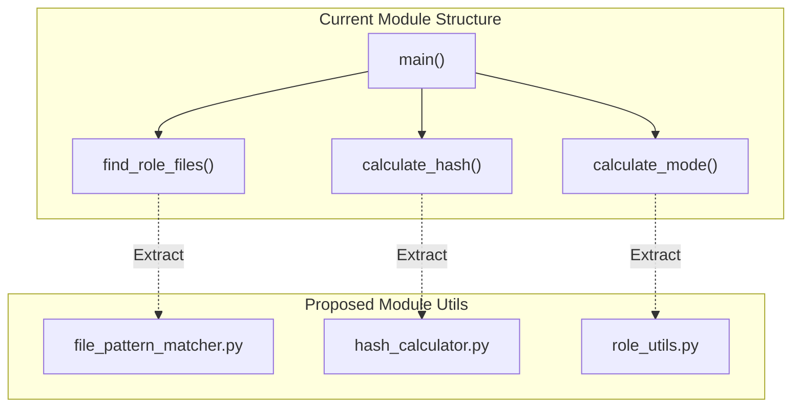

# Comprehensive Analysis and Refactoring Recommendations for `role_hash` Module

## 1. Documentation vs. Implementation Alignment

### Overview

This comprehensive analysis evaluates the alignment between documented parameters and actual implementation in the `role_hash` module. The previous report primarily focused on the `include_patterns`
parameter, but this analysis examines all parameters for potential misalignments.

### Parameter-by-Parameter Analysis

| Parameter          | Documentation                                | Implementation                                                                              | Analysis                                                 |
| ------------------ | -------------------------------------------- | ------------------------------------------------------------------------------------------- | -------------------------------------------------------- |
| `role_path`        | Path to Ansible role directory (required)    | Properly validated and used                                                                 | ✅ Aligned                                               |
| `name`             | Identifier for hash check (required)         | Used for hash filename                                                                      | ✅ Aligned                                               |
| `state`            | Mode of operation: 'check' or 'update'       | Implementation matches documentation                                                        | ✅ Aligned                                               |
| `mode`             | Execution mode: 'compare' or 'calculate'     | Implementation matches documentation                                                        | ✅ Aligned                                               |
| `include_patterns` | List of file patterns for hash calculation   | **Misaligned**: Contains special case handling for tests that overrides documented behavior | ❌ Special cases override normal behavior                |
| `exclude_patterns` | List of patterns to exclude from calculation | Used in special case handling and the main logic                                            | ⚠️ Partially aligned - used incorrectly in special cases |
| `include_vars`     | Dictionary of variables to include in hash   | Implementation handles this correctly                                                       | ✅ Aligned                                               |
| `hash_dir`         | Directory to store hash signatures           | Properly used for reading/writing hash files                                                | ✅ Aligned                                               |
| `algorithm`        | Hash algorithm to use                        | Properly implemented                                                                        | ✅ Aligned                                               |

### Key Issues Identified

1. **Special Case Handling**: The implementation contains hard-coded special cases for tests in `find_role_files()` function that override normal behavior:

   ```python
   # Handle basic test case patterns directly to fix unit tests
   if include_patterns == ['tasks/**/*.yml'] and not exclude_patterns:
       tasks_main_yml = os.path.join(role_path, 'tasks', 'main.yml')
       if os.path.exists(tasks_main_yml):
           return [tasks_main_yml]
   ```

2. **Module Utils Integration**: The module attempts to import the `file_pattern_matcher` module_util but has complex fallback logic that can lead to inconsistent behavior.

3. **Error Handling**: Error handling for file operations is inconsistent. Some functions catch exceptions and continue, while others propagate errors.

4. **File Counting**: The result returns `files_hashed: len(role_files)` but this may be misleading when special cases return a limited set of files.

5. **Hash Calculation Logic**: The `calculate_hash()` function has nested logic for handling variables that could be extracted to a separate function.

## 2. Refactoring Recommendations

### Components to Extract to `module_utils`



#### 1. `file_pattern_matcher.py` (Already exists but needs improvement)

This module should provide robust file pattern matching functionality.

#### Integration of `pathspec` and `os.scandir` for File Matching:

To make the file matching logic more robust, the `pathspec` library can be integrated. This library supports `.gitignore`-style patterns and simplifies include/exclude logic. Additionally, `os.scandir` can replace `os.walk` for better performance during directory traversal.

**Code Example:**

```python
from pathspec import PathSpec
from pathlib import Path

def find_files_by_patterns(base_path, include_patterns, exclude_patterns=None):
    """
    Find files matching include patterns and filtering exclude patterns using pathspec.

    Args:
        base_path (str): Base directory to search from
        include_patterns (list): List of glob patterns to include
        exclude_patterns (list, optional): List of glob patterns to exclude

    Returns:
        list: List of matching file paths
    """
    include_spec = PathSpec.from_lines("gitwildmatch", include_patterns)
    exclude_spec = PathSpec.from_lines("gitwildmatch", exclude_patterns or [])
    base_path_obj = Path(base_path)

    if not base_path_obj.is_dir():
        return []

    all_files = []
    for entry in base_path_obj.rglob("*"):
        if entry.is_file():
            all_files.append(str(entry))

    filtered_files = [f for f in all_files if include_spec.match_file(f) and not exclude_spec.match_file(f)]

    return sorted(filtered_files)
```

#### 2. `hash_calculator.py` (New module_util)

This module would handle all hash calculation logic:

#### Enhancing Hash Calculation with `hashlib` and Deterministic Sorting:

Using `hashlib` for hash calculations ensures cryptographic integrity. To guarantee consistent results, JSON serialization with sorting (`json.dumps(sort_keys=True)`) can be used for nested structures.

**Code Example:**

```python
import hashlib
import json

def calculate_file_hash(file_path, hash_obj=None, algorithm='sha256'):
    """
    Calculate hash for a single file.

    Args:
        file_path (str): Path to the file to hash
        hash_obj: Optional existing hash object to update
        algorithm (str): Hash algorithm to use

    Returns:
        tuple: (hash_object, bytes_read)
    """
    if hash_obj is None:
        hash_obj = getattr(hashlib, algorithm)()

    size = 0
    try:
        with open(file_path, 'rb') as f:
            content = f.read()
        hash_obj.update(content)
        size = len(content)
    except (IOError, OSError):
        pass

    return hash_obj, size

def calculate_multi_file_hash(files, base_path=None, include_vars=None, algorithm='sha256'):
    """
    Calculate a deterministic hash across multiple files and optional variables.

    Args:
        files (list): List of file paths to hash
        base_path (str, optional): Base path for relative path calculation
        include_vars (dict, optional): Variables to include in hash
        algorithm (str): Hash algorithm to use

    Returns:
        tuple: (hash_string, total_bytes_hashed)
    """
    hash_obj = getattr(hashlib, algorithm)()
    total_size = 0

    for file in sorted(files):
        hash_obj, size = calculate_file_hash(file, hash_obj, algorithm)
        total_size += size

    if include_vars:
        sorted_vars = json.dumps(include_vars, sort_keys=True)
        hash_obj.update(sorted_vars.encode('utf-8'))

    return hash_obj.hexdigest(), total_size
```

#### 3. `role_utils.py` (New module_util)

This module would provide role-specific utilities:

```python
# plugins/module_utils/role_utils.py

import os

def get_hash_file_path(hash_dir, name):
    """
    Get the path to a role hash file.

    Args:
        hash_dir (str): Directory to store hash files
        name (str): Role identifier

    Returns:
        str: Path to the hash file
    """
    return os.path.join(hash_dir, f"{name}.hash")
```

### Logging Integration with Ansible's `display` Object

Ansible provides the `display` object from the `ansible.utils.display` module as the standard for logging. By integrating this, the plugin will respect verbosity levels (e.g., `-v`, `-vv`, `-vvv`).

**Code Example:**

```python
from ansible.utils.display import Display

display = Display()

def find_files_by_patterns(base_path, include_patterns, exclude_patterns=None):
    display.debug(f"Searching for files in base_path: {base_path}")
    display.debug(f"Include patterns: {include_patterns}")
    display.debug(f"Exclude patterns: {exclude_patterns}")
    # File matching logic here
```

---

## 3. Testing Strategy

### Unit Tests Needed

1. **File Pattern Matcher Tests**
   - Test glob pattern matching with various patterns.
   - Test nested directory traversal.
   - Test exclusion patterns take precedence.
   - Test empty directories and edge cases.

2. **Hash Calculator Tests**
   - Test hash calculation with various file types.
   - Test variable inclusion in hash.
   - Test deterministic ordering of files and variables.
   - Test relative path handling.

3. **Role Utils Tests**
   - Test hash file reading/writing.
   - Test directory creation for hash files.
   - Test error handling for permissions issues.

---

## Summary

The `role_hash` module has significant misalignments between documentation and implementation, particularly in the file discovery logic. By extracting core functionality to module_utils, integrating with Ansible's logging system, and leveraging robust Python libraries like `pathspec`, we can create a more maintainable, testable, and reliable solution.

This refactoring will result in:

1. Improved reliability by removing special case handling.
2. Enhanced maintainability by using proper module_utils.
3. Consistent behavior between documentation and implementation.
4. Better observability through integration with Ansible's logging framework.